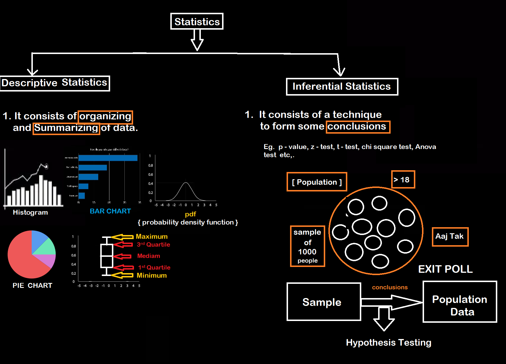

# Statistic :

**Q. What is stastistic ?**

**A.** Statistics is the science of **Collecting, Organizing and analyzing data**.

**Q. What is Data ?**

**A.** "Facts (or) Pieces of information".

**Examples :**
 

1. Ages of students in a classroom

   { 24, 30, 21, 34, ... , 20 }

2. Weights of Students in a classroom.

    { 75, 45, 50, 55, 60 }

- We can organize these data in ascending or descendingn order or in the form of Histograms, Charts, Diagrams, etc Graphically.

There are two types of Statistics :

1. Descriptive Statistics

2. Inferential Statistics

Example : Let say there are 20 classrooms in a university and you have collected the age of students in one classroom,

Ages = { 21, 20, 18, 34, 17, 22, 24, 25, 26, 23, 22 }

**Descriptive Stats** questions should be :

Q. What is the  average age of the Students in the classroom?

- Minimum age of students
- Outliers
- Distribution of the students age.
- Transformation
- Maximum Age of students.

**Inferential Stats** questions should be :

Q. Are the average Age of the student in the classroom equal to the average average ages of the entire university

