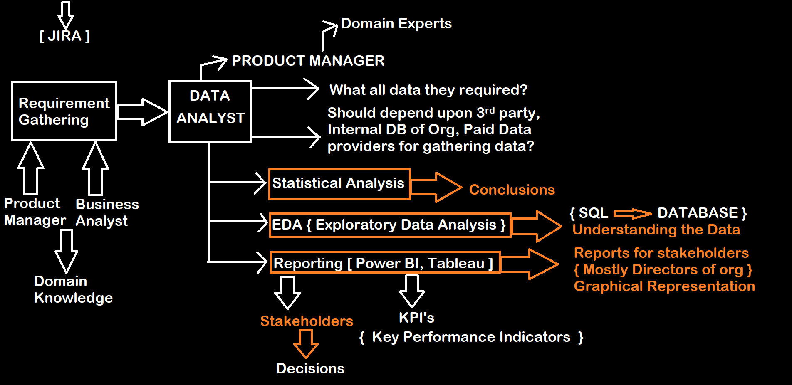

# Full Stack Data Analytics

**Q: What is Data Analytics?**

**A:** Data Analytics refers to the process of examining, cleaning, transforming, and modeling data with the goal of discovering useful information, informing conclusions, and supporting decision-making.

**Role of Data Analyst**

**A:** A Data Analyst is a professional who is responsible for performing this data analysis process, using mathematical and statistical techniques to gain insights and make data-driven recommendations. In industry, the role of a data analyst can vary depending on the company and the specific data analysis project. However, common responsibilities for a data analyst may include:

- Collecting, cleaning, and organizing data
- Creating and maintaining databases
- Analyzing data using statistical techniques
- Visualizing data using tools such as charts, graphs, and maps
- Interpreting data and presenting insights to stakeholders
- Supporting data-driven decision-making

The ultimate goal of a data analyst is to turn data into actionable insights that can drive business growth and improve decision-making. For example, Real life Problem - "Amazon Big Billion Sales" :

**Q. Amazon wants to decide when is the next Big Billion Sale but how he will decide that and who will decide it?**

A. The Big Billion Sale date is likely made by the company's "executives or management team", taking into account factors such as sales trends, company goals, and market conditions.

- But that factors are given by data analyst They may play a role in the decision-making process for the next Amazon Big Billion Sale.

- A data analyst may gather and analyze data on factors such as previous sales performance, customer behavior, and market trends, and provide insights and recommendations to help inform the decision on the next sale date.

- The data analysis may also help determine the best time to launch the sale, based on factors such as seasonality, competition, and market demand.

____________________________________________

